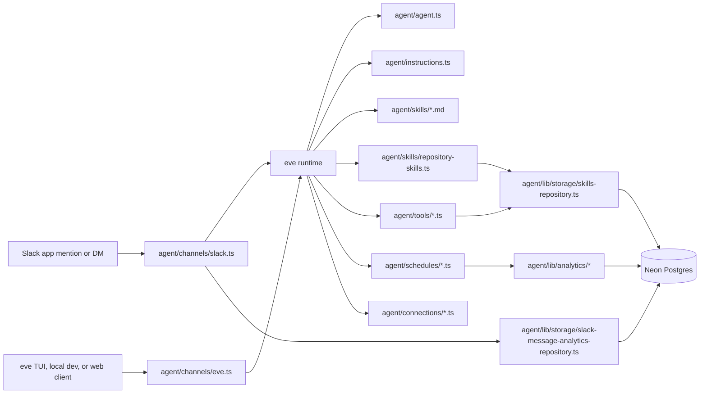
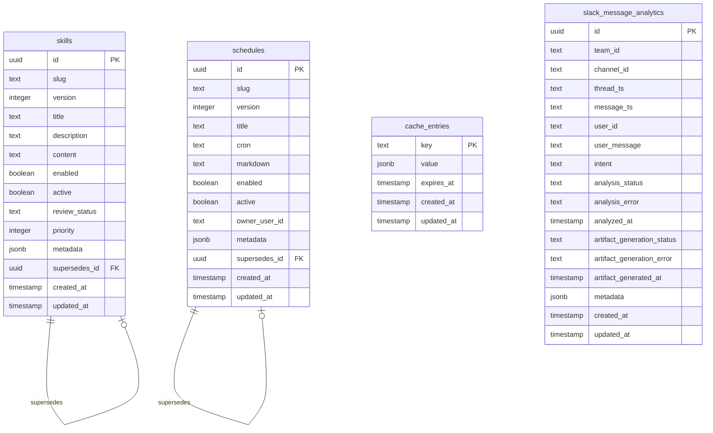
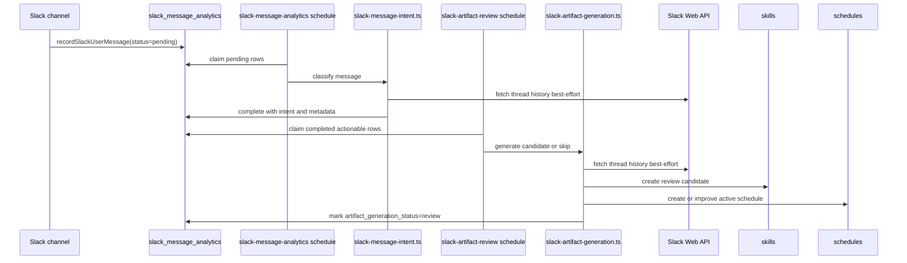

# Agent Engineering Guide

This repository is an eve agent app for Slack and web messaging. It uses
filesystem-discovered eve modules, Vercel Connect for Slack credentials, and
Neon Postgres with Drizzle for runtime skills, cache entries, and Slack message
analytics.

Use this file as the primary guide when an AI coding agent works in this repo.
`CLAUDE.md` points here, and the README contains the human-facing project
overview.

## First Principles

- Preserve eve's filesystem-first architecture. Put authored eve modules in the
  supported directories under `agent/`: `channels/`, `connections/`, `tools/`,
  `schedules/`, `skills/`, and shared code under `lib/`.
- Keep shared utilities, storage code, analytics code, prompt constants, and auth
  helpers under `agent/lib/`.
- Do not add unsupported agent-root directories such as `agent/prompts/`.
- Keep Slack channel glue in `agent/channels/` and core logic in `agent/lib/`.
- Keep prompt text in `agent/lib/prompts/{feature}-prompt.ts` as multiline
  template literals.
- Keep repository content in English.
- Keep changes small, explicit, and aligned with local patterns.

Before changing eve behavior, read the relevant installed eve docs from
`node_modules/eve/docs/` when available. If package docs are unavailable in the
workspace, use the repository code and https://eve.dev/docs as fallback context.

## Architecture at a Glance



## Directory Map

```text
agent/
|-- agent.ts
|-- instructions.ts
|-- channels/
|   |-- eve.ts
|   `-- slack.ts
|-- connections/
|   |-- github.ts
|   `-- notion.ts
|-- lib/
|   |-- analytics/
|   |   |-- artifact-inventory.ts
|   |   |-- slack-artifact-generation.ts
|   |   |-- slack-artifact-generation-processor.ts
|   |   |-- slack-message-analysis-processor.ts
|   |   `-- slack-message-intent.ts
|   |-- auth/
|   |   `-- skill-admin.ts
|   |-- prompts/
|   |   |-- instructions-prompt.ts
|   |   |-- slack-artifact-generation-prompt.ts
|   |   `-- slack-message-intent-prompt.ts
|   |-- skills/
|   |   `-- tool-output.ts
|   `-- storage/
|       |-- cache.ts
|       |-- db.ts
|       |-- schema.ts
|       |-- skills-repository.ts
|       `-- slack-message-analytics-repository.ts
|-- schedules/
|   |-- slack-artifact-review.ts
|   `-- slack-message-analytics.ts
|-- skills/
|   |-- clarifying-questions.md
|   `-- repository-skills.ts
`-- tools/
    |-- approve_skill_review_candidate.ts
    |-- deactivate_active_skill.ts
    |-- delete_skill.ts
    |-- get_active_skills.ts
    |-- get_current_datetime.ts
    |-- get_skill_review_candidates.ts
    `-- get_weather.ts
```

Other important roots:

- `drizzle/`: generated SQL migrations and Drizzle metadata.
- `proto/features/`: approved feature plans.
- `.cursor/rules/`: always-applied repository rules.
- `.cursor/skills/`: local Cursor skills such as `/clean-code` and
  `/gen-commits`.
- `.cursor/hooks.json`: Cursor hook wiring.
- `.vscode/launch.json`: debug profiles for `eve dev` and `eve start`.
- `.eve/`: generated/local eve runtime output, gitignored.

## Runtime Modules

### `agent/agent.ts`

Defines the eve agent with `defineAgent`. The current default model is
`google/gemma-4-31b-it`.

When changing model configuration, keep the change central in this file unless a
specific feature already supports an environment-variable override.

### `agent/instructions.ts`

Defines dynamic always-on instructions with `defineDynamic`. It loads
`INSTRUCTIONS_PROMPT` on the `session.started` event and returns
`defineInstructions({ markdown })`.

The prompt body lives in `agent/lib/prompts/instructions-prompt.ts`.

### `agent/channels/eve.ts`

Defines the eve channel auth stack:

- `localDev()` for localhost and `eve dev`.
- `vercelOidc()` for the eve TUI and Vercel deployments.
- `placeholderAuth()` as a placeholder that must be replaced before production
  browser exposure.

### `agent/channels/slack.ts`

Defines the Slack channel with `slackChannel` and Vercel Connect credentials:
`connectSlackCredentials("slack/eve")`.

Both `onAppMention` and `onDirectMessage` call `handleSlackMessage`. That helper:

1. Builds default Slack auth with eve's `defaultSlackAuth`.
2. Records the incoming Slack user message in Postgres through
   `recordSlackUserMessage`.
3. Loads thread context since the agent's last reply with
   `loadThreadContextMessages`.
4. Returns auth plus optional transcript context to the eve runtime.

Analytics recording is best-effort and logs errors instead of blocking the
response path.

## Storage Layer

The storage source of truth is `agent/lib/storage/schema.ts`. The runtime uses a
lazy Neon HTTP Drizzle client from `agent/lib/storage/db.ts`; it requires
`DATABASE_URL`.



### `skills`

Stores DB-backed eve skills and review candidates.

- Runtime loading requires `enabled = true` and `active = true`.
- `reviewStatus` is `review`, `approved`, or `deleted`.
- Versions are scoped by `slug`.
- Only one active row per slug is allowed.
- New approved versions deactivate previous active versions.
- `metadata.lifecycle` records approval, deactivation, and deletion details.

### `schedules`

Stores DB-backed Eve schedules generated from Slack analytics.

- Runtime dispatcher execution is not implemented yet; rows are stored for
  lifecycle management and future dynamic dispatch.
- Runtime eligibility requires `enabled = true` and `active = true`.
- Versions are scoped by `(ownerUserId, slug)`.
- Only one active row per `(ownerUserId, slug)` is allowed.
- `schedule.improve` creates a new active version and deactivates the previous
  active version for the same owner and slug.
- `metadata.lifecycle` records deletion details.

### `cache_entries`

Stores reusable JSON cache entries. Active DB skills use cache key
`eve:skills:v1` with a 5 minute TTL.

### `slack_message_analytics`

Stores incoming Slack messages and async processing status.

- `analysisStatus`: `pending`, `processing`, `completed`, or `failed`.
- `intent`: `skill.create`, `skill.improve`, `schedule.create`,
  `schedule.improve`, or `none`.
- `artifactGenerationStatus`: `pending`, `processing`, `review`, `skipped`, or
  `failed`.
- `metadata` stores Slack source information, prompt hashes, model usage,
  rationale, generated artifact ids, and lifecycle context.

## Repositories

### `agent/lib/storage/skills-repository.ts`

Owns DB-backed skill reads and lifecycle operations.

- `getSkills()` loads active and enabled skills through cache-aside storage.
- `getActiveSkills()` lists active skills for admin tools.
- `getSkillReviewCandidates()` lists `review` rows.
- `upsertSkillVersion()` creates or replaces an already-approved active skill.
- `createSkillReviewCandidate()` creates a disabled, inactive review row.
- `approveSkillReviewCandidate()` activates a candidate and deactivates the
  previous active version for the same slug inside a transaction.
- `deactivateSkill()` disables an active skill.
- `softDeleteSkill()` marks a skill as deleted and inactive.
- Mutations call `invalidateSkillsCache()`.

### `agent/lib/storage/schedules-repository.ts`

Owns DB-backed schedule reads and lifecycle operations.

- `createSchedule()` inserts a new active schedule for a Slack owner.
- `upsertScheduleVersion()` creates a new active version for a schedule and
  deactivates the previous active version for the same owner and slug.
- `getActiveSchedules()` lists active schedules, optionally filtered by owner or
  slug.
- `softDeleteSchedule()` disables a schedule when the requester is the owner or
  an admin.

### `agent/lib/storage/slack-message-analytics-repository.ts`

Owns Slack analytics persistence and job claiming.

- `recordSlackUserMessage()` inserts or updates one Slack message by
  `(teamId, channelId, messageTs)`.
- `claimPendingSlackMessageAnalyses()` claims pending analysis rows with
  `FOR UPDATE SKIP LOCKED`.
- `completeSlackMessageAnalysis()` stores the model-classified intent.
- `failSlackMessageAnalysis()` records a bounded error message.
- `claimPendingSlackArtifactGenerations()` claims completed actionable rows for
  `skill.create`, `skill.improve`, `schedule.create`, and `schedule.improve`.
- `completeSlackArtifactGeneration()` stores `review` or `skipped`.
- `failSlackArtifactGeneration()` records generation failures.

The claim functions clamp batch sizes between 1 and 50.

## Analytics Flow



The intent analyzer uses `SLACK_MESSAGE_INTENT_PROMPT`, best-effort Slack thread
history from `agent/lib/slack/thread-history.ts`, and a compact inventory of
active DB skills plus the Slack user's active schedules so the model can decide
whether the message asks to create or improve an artifact. Schedule inventory is
scoped to the triggering Slack user to avoid improving another user's schedule.

The artifact generator uses `SLACK_ARTIFACT_GENERATION_PROMPT`, the analytics
row, the same artifact inventory, and best-effort Slack thread history from
`agent/lib/slack/thread-history.ts`. It normalizes model output, enforces a
lowercase kebab-case slug, and skips rows that do not produce a complete skill or
schedule candidate. Schedule candidates require both a five-field `cron` and a
`markdown` prompt. Slack history fetch failures are stored as generation
metadata warnings and must not block artifact generation.

## Dynamic Skills

`agent/skills/repository-skills.ts` loads DB-backed skills on both
`session.started` and `turn.started`.

For every active skill row, it returns an eve `defineSkill` entry:

- Key format: `repo-{slug}` after slug normalization.
- Description: DB `description`, or a generated fallback based on `title`.
- Markdown: DB `content`.

This means newly approved skills can affect future turns without code changes.
The cache TTL means changes may take up to 5 minutes to appear if they were not
made through repository mutation helpers that invalidate the cache.

## Tools and Admin Auth

Skill admin tools call `requireSkillAdmin(ctx)` from
`agent/lib/auth/skill-admin.ts`.

`requireSkillAdmin`:

1. Reads `SKILL_ADMIN_USER_IDS`.
2. Reads the Slack user id from `ctx.session.auth.current.attributes["user_id"]`.
3. Throws if the env var is empty or the user is not allowed.

Admin-gated tools:

- `get_skill_review_candidates`: lists review candidates.
- `approve_skill_review_candidate`: approves a candidate and activates it.
- `get_active_skills`: lists active DB-backed skills.
- `deactivate_active_skill`: deactivates by `id` or `slug`.
- `delete_skill`: soft-deletes by `id`.

Schedule access uses `requireScheduleAccess(ctx)` from
`agent/lib/auth/schedule-access.ts`.

Schedule tools:

- `get_active_schedules`: lists schedules owned by the Slack user; admins can
  request all owners.
- `delete_schedule`: soft-deletes a schedule when the Slack user owns it or is
  listed in `SKILL_ADMIN_USER_IDS`.

Slack delivery tools use `requireSlackToolContext(ctx)` from
`agent/lib/slack/context.ts` and shared Slack Web API helpers from
`agent/lib/slack/api.ts`.

Slack delivery tools:

- `send_slack_message`: posts a Slack message to the current thread or sends a
  direct message. Thread delivery defaults to the current channel/thread; DM
  delivery defaults to the triggering Slack user.
- `send_slack_file`: uploads generated text content as a Slack file to the
  current thread or to a direct message.

Use delivery tools only when the user asks or when delivery is clearly useful to
complete the task. Do not send DMs to third parties by default, and do not send
secrets or private chain-of-thought. The connected Slack app must have the
required Slack scopes for `chat.postMessage`, `conversations.open`, and external
file upload APIs.

General utility tools:

- `get_current_datetime`: returns localized current datetime.
- `get_weather`: uses Open-Meteo geocoding and forecast APIs for current
  weather by city.

## Schedules

### `agent/schedules/slack-message-analytics.ts`

- Cron: `* * * * *`
- Processor: `processPendingSlackMessageAnalyses`
- Default batch size: 10
- Logs only when at least one row was claimed.

### `agent/schedules/slack-artifact-review.ts`

- Cron: `*/5 * * * *`
- Processor: `processPendingSlackArtifactGenerations`
- Default batch size: 5
- Logs only when at least one row was claimed.

## Prompt Files

All authored prompt constants belong in `agent/lib/prompts/`.

- `instructions-prompt.ts`: base always-on agent behavior.
- `slack-message-intent-prompt.ts`: structured Slack intent classification.
- `slack-artifact-generation-prompt.ts`: skill candidate generation from
  analytics rows.

Use multiline template literals so prompt text reads like markdown and remains
easy to edit.

## Migrations

Drizzle config lives in `drizzle.config.ts` and points to
`agent/lib/storage/schema.ts`.

Workflow:

1. Change `agent/lib/storage/schema.ts`.
2. Run `npm run db:generate`.
3. Review the generated SQL under `drizzle/`.
4. Run `npm run db:migrate` after `.env.local` contains `DATABASE_URL`.
5. Run `npm run typecheck`.

Existing migrations:

- `0000_lethal_tigra.sql`: initial `skills` table.
- `0001_smooth_shinko_yamashiro.sql`: `cache_entries`.
- `0002_late_dark_phoenix.sql`: `slack_message_analytics`.
- `0003_illegal_obadiah_stane.sql`: artifact-generation fields and indexes.

## Environment Expectations

`.env.example` documents local environment setup.

- `DATABASE_URL` is required for Drizzle migrations, runtime DB access, cache,
  runtime skills, and Slack analytics.
- Slack credentials are resolved through Vercel Connect and should not be added
  to `.env.local`.
- `SKILL_ADMIN_USER_IDS` is required before skill lifecycle tools can mutate or
  inspect DB-backed skills.
- Analysis and generation model env vars are optional overrides.

## Development Commands

- `npm run dev`: local eve development server.
- `npm run build`: compile the eve agent.
- `npm run start`: run compiled output.
- `npm run typecheck`: TypeScript type checking.
- `npm run db:generate`: generate migrations.
- `npm run db:migrate`: apply migrations.
- `npm run db:studio`: open Drizzle Studio.

## Coding Guidance

- Prefer simple TypeScript and explicit control flow.
- Reuse existing repositories and helpers before adding abstractions.
- Keep storage access inside `agent/lib/storage/`.
- Keep Slack-specific request shaping inside `agent/channels/slack.ts`.
- Keep model prompt text in `agent/lib/prompts/`; keep model orchestration in
  `agent/lib/analytics/`.
- For new DB-backed runtime behavior, update schema, repository code, migration,
  and docs together.
- For new Slack analytics behavior, update both the processor flow and prompt
  metadata so later reviews can trace model decisions.
- For new tools, use `defineTool`, a `zod` input schema, and small return
  objects. Put shared output formatting in `agent/lib/`.
- For admin-only tools, call `requireSkillAdmin(ctx)` before reading or mutating
  privileged skill data.

## Cursor Workflows

This repository includes Cursor guidance under `.cursor/`:

- `.cursor/rules/senior-js-eve-slack.mdc`: senior JavaScript and eve/Slack
  architecture standards.
- `.cursor/rules/repository-language-policy.mdc`: repository content must be in
  English; chat replies follow the user's language.
- `.cursor/rules/plan-mode-feature-docs.mdc`: approved Plan Mode work is saved
  under `proto/features/`.
- `.cursor/skills/clean-code/SKILL.md`: local cleanup skill.
- `.cursor/skills/gen-commits/SKILL.md`: commit generation workflow.
- `.cursor/hooks.json`: stop hook wiring.
- `.cursor/hooks/gen-commits-clean-code.js`: runs a bounded clean-code follow-up
  for `/gen-commits`.

Do not commit `checkpoint.md`.

## Common Change Patterns

### Add a new runtime skill in source

Add a markdown file under `agent/skills/` when the skill should be versioned in
git and always available from source.

### Add or change DB-backed runtime skills

Use repository functions in `agent/lib/storage/skills-repository.ts` or the
admin tools. Do not bypass cache invalidation when mutating active skills.

### Add a new skill lifecycle tool

Create `agent/tools/{tool_name}.ts`, use `defineTool`, validate input with
`zod`, call `requireSkillAdmin(ctx)`, delegate storage changes to
`skills-repository.ts`, and reuse `toSkillToolOutput`.

### Add a new analytics artifact type

Extend the schema and repositories first, then update:

- `artifact-inventory.ts`
- `slack-message-intent.ts`
- `slack-artifact-generation.ts`
- `slack-artifact-generation-processor.ts`
- prompt constants under `agent/lib/prompts/`
- migrations and documentation

Keep backward compatibility for persisted rows.

### Change Slack handling

Start in `agent/channels/slack.ts`. Keep the channel focused on Slack auth,
event normalization, context loading, and best-effort analytics recording. Move
reusable or storage-heavy behavior into `agent/lib/`.

### Change storage schema

Edit `agent/lib/storage/schema.ts`, generate a migration, and review indexes and
repository query paths. Preserve existing persisted data unless a migration
explicitly transforms it.

## Verification Checklist

For documentation-only changes:

- Read the changed markdown for broken headings, stale file paths, and invalid
  Mermaid syntax.

For TypeScript changes:

- Run `npm run typecheck`.
- Run the relevant dev path with `npm run dev` when the change touches channels,
  tools, schedules, or runtime loading.

For storage changes:

- Run `npm run db:generate`.
- Review generated SQL.
- Run `npm run db:migrate` only with a valid `.env.local`.

For Slack or skill lifecycle changes:

- Verify `SKILL_ADMIN_USER_IDS` behavior.
- Check that Slack ingress can still respond if analytics recording fails.
- Check that cache invalidation happens after active skill mutations.
