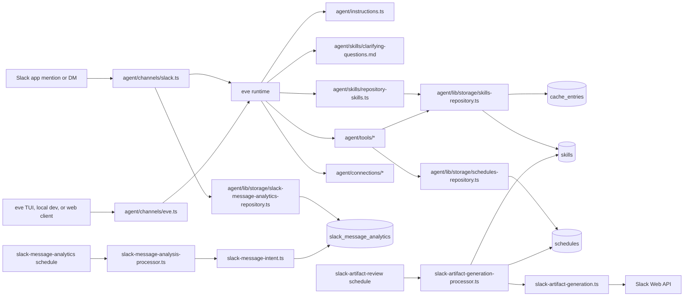
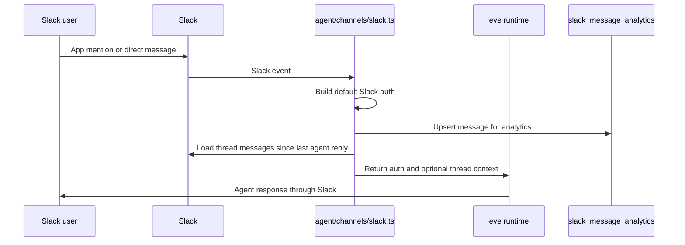
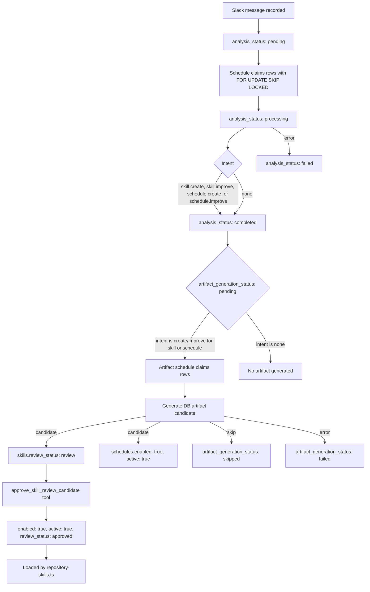
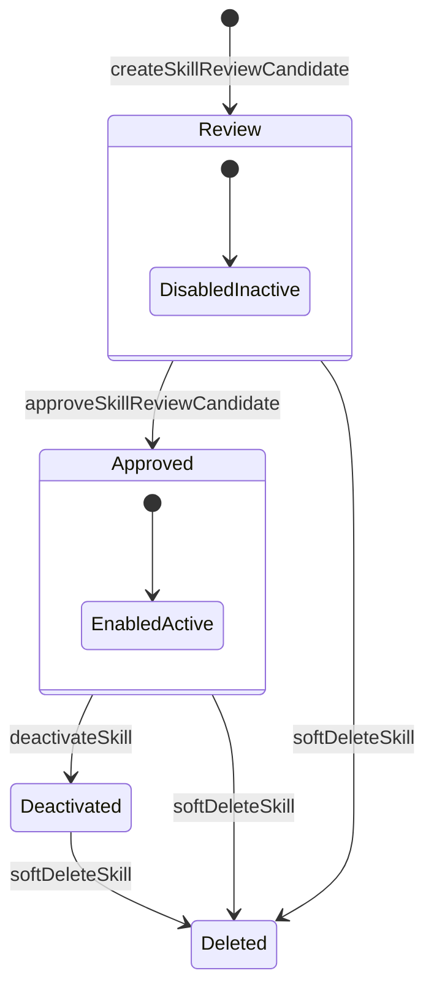
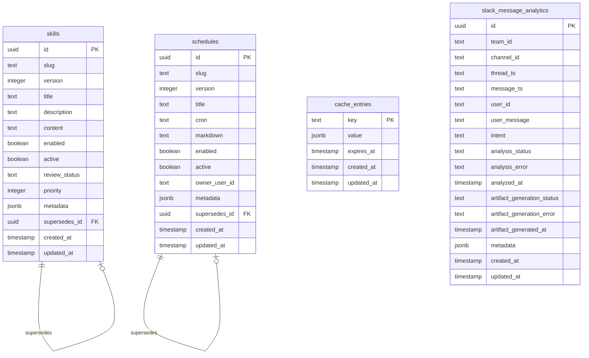

# slack-ai-agent-eve

An [eve](https://eve.dev) agent application for Slack and web messaging. The app
uses eve's filesystem-first runtime, Vercel Connect for Slack credentials, and
Neon Postgres with Drizzle for runtime skills, cache entries, and Slack message
analytics.

The most important product behavior is:

- Users talk to the agent through Slack app mentions, Slack direct messages, or
  the eve channel.
- Slack messages are stored in Postgres for asynchronous analysis.
- Scheduled jobs classify Slack messages and may turn durable user feedback into
  reviewable DB-backed skills or active DB-backed schedules.
- Admin-gated tools approve, deactivate, list, or soft-delete DB-backed skills,
  and schedule-owner tools list or delete DB-backed schedules.
- Active DB-backed skills are loaded into eve dynamically on each session and
  turn, so the agent can improve without changing source files.

## Prerequisites

- Node.js 24.x
- npm
- A Neon Postgres database for runtime storage
- A Vercel Connect Slack integration for deployed Slack messaging

## Quick Start

```bash
npm install
cp .env.example .env.local
npm run db:migrate
npm run dev
```

Fill `DATABASE_URL` in `.env.local` before running migrations or any
storage-backed runtime code. If you want to use skill review, skill lifecycle,
or cross-owner schedule management tools, also set `SKILL_ADMIN_USER_IDS` to a
comma-separated list of Slack user ids allowed to manage DB-backed skills and
schedules.

## Environment Variables

| Variable | Required | Used by | Purpose |
| --- | --- | --- | --- |
| `DATABASE_URL` | Yes for storage-backed features | `agent/lib/storage/db.ts`, `drizzle.config.ts` | Neon Postgres connection string for Drizzle, cache, runtime skills, and Slack analytics. |
| `SKILL_ADMIN_USER_IDS` | Yes for skill admin and schedule admin behavior | `agent/lib/auth/skill-admin.ts`, `agent/lib/auth/schedule-access.ts` | Comma-separated Slack user ids that may approve, deactivate, delete, or inspect DB-backed skills, and list or delete schedules across owners. |
| `SLACK_MESSAGE_ANALYSIS_MODEL` | Optional | `agent/lib/analytics/slack-message-intent.ts` | Overrides the model used to classify Slack messages. Defaults to `google/gemma-4-31b-it`. |
| `SLACK_ARTIFACT_GENERATION_MODEL` | Optional | `agent/lib/analytics/slack-artifact-generation.ts` | Overrides the model used to generate skill and schedule artifacts. Falls back to `SLACK_MESSAGE_ANALYSIS_MODEL`, then `google/gemma-4-31b-it`. |

Slack bot credentials are not stored in `.env.local`. They are resolved through
`@vercel/connect` by `connectSlackCredentials("slack/eve")` in
`agent/channels/slack.ts`.

## Scripts

| Command | Description |
| --- | --- |
| `npm run dev` | Start the local eve development server. |
| `npm run build` | Compile the agent for deployment. |
| `npm run start` | Run the compiled agent. |
| `npm run typecheck` | Run TypeScript type checking. |
| `npm run db:generate` | Generate Drizzle migrations from `agent/lib/storage/schema.ts`. |
| `npm run db:migrate` | Apply Drizzle migrations using `.env.local`. |
| `npm run db:studio` | Open Drizzle Studio using `.env.local`. |

## High-Level Architecture



## Request Flow

### Slack Message Flow



`agent/channels/slack.ts` handles both `onAppMention` and `onDirectMessage` with
the same `handleSlackMessage` function. The channel records the incoming message
for analytics, then asks eve's Slack helper for recent thread messages since the
agent's last reply. If there is prior context, the channel passes a transcript to
the runtime as extra context.

### Eve Channel Flow

`agent/channels/eve.ts` exposes the standard eve channel. Its auth stack is:

- `localDev()` for local `eve dev` and REPL usage.
- `vercelOidc()` for the eve TUI and Vercel deployments.
- `placeholderAuth()` as a production placeholder that should be replaced before
  exposing browser requests in production.

## Learning and Skill Review Flow

The repository has a feedback loop that turns Slack messages into reviewable
runtime skills and owner-scoped runtime schedules.



The process is intentionally asynchronous:

1. Slack ingress remains fast and resilient. Analytics writes are wrapped in a
   `try/catch`, so a storage failure does not block the response path.
2. `agent/schedules/slack-message-analytics.ts` runs every minute and processes
   pending Slack analytics rows in batches of 10.
3. `agent/schedules/slack-artifact-review.ts` runs every 5 minutes and processes
   completed actionable analytics rows in batches of 5.
4. Generated skill candidates are not activated immediately. They are stored as
   disabled, inactive review candidates until an admin approves them.
5. Generated schedules are created or improved directly as active
   owner-scoped schedule rows.

During artifact generation, the generator can also fetch Slack thread history
best-effort from the Slack Web API so candidates can use richer context than
the single triggering message.

## Skill Lifecycle



Skill rows are versioned by `slug` and `version`. Only one active row per slug is
allowed by the `skills_active_slug_unique` partial unique index. When a review
candidate is approved, the repository deactivates the previous active version for
that slug and activates the approved candidate. Mutating operations invalidate
the `eve:skills:v1` cache key.

## Database Schema

The schema source of truth is `agent/lib/storage/schema.ts`. Migrations are
generated into `drizzle/`.



### `skills`

Stores DB-backed runtime skills and review candidates.

- `slug` is the stable logical name.
- `version` increments per slug.
- `content` is the markdown loaded into eve as a skill.
- `enabled` and `active` both need to be true for runtime loading.
- `reviewStatus` is `review`, `approved`, or `deleted`.
- `priority` controls runtime ordering.
- `metadata` stores lifecycle, Slack source, analysis, and generation metadata.
- `supersedesId` links a newer version to the version it replaced.

### `schedules`

Stores DB-backed Eve schedules generated from Slack analytics.

- `ownerUserId` scopes schedule ownership to a Slack user.
- `slug` and `version` identify schedule revisions for one owner.
- `cron` stores a five-field schedule expression.
- `markdown` stores the recurring prompt passed to Eve.
- `enabled` and `active` both need to be true for runtime eligibility.
- `supersedesId` links an improved version to the replaced schedule.

### `cache_entries`

Generic Postgres-backed cache table. Runtime skills use the `eve:skills:v1` key
with a 5 minute TTL.

### `slack_message_analytics`

Stores Slack messages and asynchronous processing state.

- `analysisStatus`: `pending`, `processing`, `completed`, or `failed`.
- `intent`: `skill.create`, `skill.improve`, `schedule.create`,
  `schedule.improve`, or `none`.
- `artifactGenerationStatus`: `pending`, `processing`, `review`, `skipped`, or
  `failed`.
- `metadata`: structured details from Slack ingress, model classification,
  generated review candidates, prompt hashes, usage, and source links.

## Project Layout

```text
.
├── agent/
│   ├── agent.ts
│   ├── instructions.ts
│   ├── channels/
│   │   ├── eve.ts
│   │   └── slack.ts
│   ├── connections/
│   │   ├── github.ts
│   │   └── notion.ts
│   ├── lib/
│   │   ├── analytics/
│   │   │   ├── artifact-inventory.ts
│   │   │   ├── slack-artifact-generation.ts
│   │   │   ├── slack-artifact-generation-processor.ts
│   │   │   ├── slack-message-analysis-processor.ts
│   │   │   └── slack-message-intent.ts
│   │   ├── auth/
│   │   │   ├── schedule-access.ts
│   │   │   └── skill-admin.ts
│   │   ├── prompts/
│   │   │   ├── instructions-prompt.ts
│   │   │   ├── slack-artifact-generation-prompt.ts
│   │   │   └── slack-message-intent-prompt.ts
│   │   ├── slack/
│   │   │   └── thread-history.ts
│   │   ├── schedules/
│   │   │   └── tool-output.ts
│   │   ├── skills/
│   │   │   └── tool-output.ts
│   │   └── storage/
│   │       ├── cache.ts
│   │       ├── db.ts
│   │       ├── schema.ts
│   │       ├── schedules-repository.ts
│   │       ├── skills-repository.ts
│   │       └── slack-message-analytics-repository.ts
│   ├── schedules/
│   │   ├── slack-artifact-review.ts
│   │   └── slack-message-analytics.ts
│   ├── skills/
│   │   ├── clarifying-questions.md
│   │   └── repository-skills.ts
│   └── tools/
│       ├── approve_skill_review_candidate.ts
│       ├── deactivate_active_skill.ts
│       ├── delete_skill.ts
│       ├── delete_schedule.ts
│       ├── get_active_skills.ts
│       ├── get_active_schedules.ts
│       ├── get_current_datetime.ts
│       ├── get_skill_review_candidates.ts
│       └── get_weather.ts
├── drizzle/
├── proto/features/
├── .cursor/
├── .vscode/
├── AGENTS.md
├── CLAUDE.md
├── README.md
├── drizzle.config.ts
├── package.json
└── tsconfig.json
```

### Agent Root

- `agent/agent.ts` defines the eve agent and its default model:
  `google/gemma-4-31b-it`.
- `agent/instructions.ts` dynamically loads the base instruction prompt on
  `session.started`.
- `agent/lib/prompts/instructions-prompt.ts` contains the editable markdown
  prompt used by `agent/instructions.ts`.

### Channels

- `agent/channels/eve.ts` configures the eve channel and auth providers.
- `agent/channels/slack.ts` configures the Slack channel, resolves credentials
  through Vercel Connect, records Slack messages for analytics, and adds recent
  thread context.

### Connections

- `agent/connections/github.ts` configures the GitHub MCP client connection
  through Vercel Connect.
- `agent/connections/notion.ts` configures the Notion MCP client connection
  through Vercel Connect.

### Skills

- `agent/skills/clarifying-questions.md` is a static source-controlled skill.
- `agent/skills/repository-skills.ts` dynamically loads active DB-backed skills
  on `session.started` and `turn.started`.
- Runtime skill keys are prefixed with `repo-` and derived from the DB skill
  slug.

### Tools

- `approve_skill_review_candidate.ts` approves a review candidate and makes it
  active.
- `deactivate_active_skill.ts` disables an active DB-backed skill by id or slug.
- `delete_skill.ts` soft-deletes a DB-backed skill.
- `delete_schedule.ts` soft-deletes a DB-backed schedule owned by the caller or
  by any owner when the caller is an admin.
- `get_active_skills.ts` lists active DB-backed skills.
- `get_active_schedules.ts` lists active DB-backed schedules for the caller,
  with optional admin-wide listing.
- `get_skill_review_candidates.ts` lists review candidates.
- `get_current_datetime.ts` returns the current localized datetime.
- `get_weather.ts` resolves a city through Open-Meteo geocoding and returns the
  current forecast.

Skill lifecycle tools are guarded by `requireSkillAdmin`, which reads the Slack
user id from `ctx.session.auth.current.attributes["user_id"]` and checks it
against `SKILL_ADMIN_USER_IDS`.

Schedule tools are guarded by `requireScheduleAccess`, which reads the current
Slack user id and marks whether the user is an admin from
`SKILL_ADMIN_USER_IDS`.

### Schedules

- `agent/schedules/slack-message-analytics.ts` runs every minute and calls
  `processPendingSlackMessageAnalyses`.
- `agent/schedules/slack-artifact-review.ts` runs every 5 minutes and calls
  `processPendingSlackArtifactGenerations`.

### Shared Libraries

Keep reusable source code under `agent/lib/` so eve does not treat it as an
unsupported authored agent directory.

- `agent/lib/storage/` owns Neon, Drizzle schema, repositories, and cache.
- `agent/lib/analytics/` owns Slack intent analysis and artifact generation.
- `agent/lib/slack/` owns Slack Web API helpers used by analytics/generation.
- `agent/lib/prompts/` owns editable prompt constants as multiline template
  literals.
- `agent/lib/auth/` owns admin authorization helpers.
- `agent/lib/skills/` owns shared skill serialization helpers.

## Migrations and Storage Workflow

The Drizzle workflow is:

1. Edit `agent/lib/storage/schema.ts`.
2. Run `npm run db:generate`.
3. Review the generated SQL under `drizzle/`.
4. Ensure `.env.local` has a valid `DATABASE_URL`.
5. Run `npm run db:migrate`.
6. Run `npm run typecheck`.

Existing migrations:

- `drizzle/0000_lethal_tigra.sql`: creates the `skills` table.
- `drizzle/0001_smooth_shinko_yamashiro.sql`: creates `cache_entries`.
- `drizzle/0002_late_dark_phoenix.sql`: creates `slack_message_analytics`.
- `drizzle/0003_illegal_obadiah_stane.sql`: adds review/artifact-generation
  columns and indexes.
- `drizzle/0004_same_vance_astro.sql`: adds the `schedules` table and indexes.

## Development Notes

- Replace `placeholderAuth()` in `agent/channels/eve.ts` before exposing browser
  requests in production.
- Point `connectSlackCredentials("slack/eve")` in `agent/channels/slack.ts` at
  the deployed Vercel Connect Slack client UID, then attach its trigger to
  `/eve/v1/slack`.
- Slack ingress records analytics best-effort; storage failures are logged but
  do not block the agent response.
- Analytics and artifact schedules use row claiming with `FOR UPDATE SKIP
  LOCKED`, which lets multiple workers avoid processing the same row.
- Active DB skills are cached for 5 minutes and cache is invalidated after
  approval, deactivation, direct upsert, or soft deletion.
- Prompt constants belong in `agent/lib/prompts/{feature}-prompt.ts` and should
  be multiline template literals.
- VS Code launch profiles in `.vscode/launch.json` run `eve dev` and
  `eve start` with source maps enabled.
- Compiled artifacts and local runtime state are written under `.eve/` and are
  gitignored.

## Cursor and Agent Workflows

This repository includes guidance for AI-assisted development:

- `AGENTS.md` is the main engineering guide for coding agents.
- `CLAUDE.md` points to `AGENTS.md`.
- `.cursor/rules/` contains always-applied repository rules.
- `.cursor/skills/` contains local skills such as `/clean-code` and
  `/gen-commits`.
- `.cursor/hooks.json` wires stop hooks. The `/gen-commits` flow runs a
  follow-up `/clean-code` pass through `.cursor/hooks/gen-commits-clean-code.js`.
- Approved feature plans are stored in `proto/features/`.

## Documentation

- [eve docs](https://eve.dev/docs)
- Installed eve package docs, when available: `node_modules/eve/docs/`
- Agent guidance for AI assistants: [AGENTS.md](./AGENTS.md)
