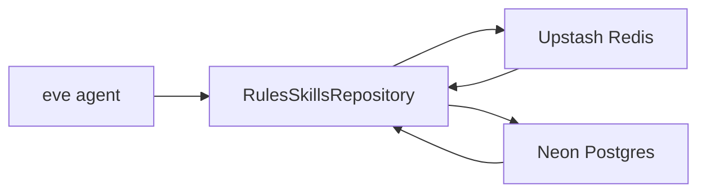

# Storage For Rules And Skills

## Goal

Add a storage layer for the eve Slack agent that stores runtime `rules` and `skills` in Neon Postgres and reads them through an Upstash Redis cache-aside repository.

Initial content import is intentionally out of scope. Empty Postgres tables must return `[]`, and the repository must cache that empty array in Redis so repeated reads do not hit Postgres unnecessarily.

## Architecture

The current eve runtime is minimal:

- `agent/agent.ts` calls `defineAgent`.
- `agent/instructions.md` contains the basic identity prompt.
- `agent/channels/slack.ts` handles Slack app mentions and recent thread context.

This feature creates the storage and repository API first. Loading the returned rules and skills into the agent runtime is a follow-up step after the repository exists and the current eve runtime injection point is confirmed.

## Dependencies

Runtime dependencies:

- `@neondatabase/serverless`
- `drizzle-orm`
- `@upstash/redis`

Development and migration dependencies:

- `drizzle-kit`
- `dotenv-cli`

## Files

Add or update:

- `drizzle.config.ts`
- `agent/storage/schema.ts`
- `agent/storage/db.ts`
- `agent/storage/redis.ts`
- `agent/storage/rules-skills-repository.ts`
- `package.json`
- `package-lock.json`

## Environment Variables

Required runtime variables:

- `DATABASE_URL`
- `UPSTASH_REDIS_REST_URL`
- `UPSTASH_REDIS_REST_TOKEN`

`.env*` is already ignored in `.gitignore`, so secrets must not be committed.

## Package Scripts

Add Drizzle scripts:

- `db:generate` to generate migrations.
- `db:migrate` to apply migrations.
- `db:studio` for local inspection.

Node scripts that need Vercel-provisioned env vars should load `.env.local` explicitly with `dotenv-cli`; Next.js-style automatic env loading should not be assumed for standalone Drizzle commands.

## Data Model

Rules and skills are versioned. Each update creates a new row with `version + 1`, and the previous active row for the same `slug` is disabled.

### `rules`

Columns:

- `id` uuid primary key
- `slug` text
- `version` integer, default `1`
- `title` text
- `content` text
- `scope` text, default `global`
- `enabled` boolean, default `true`
- `active` boolean, default `true`
- `priority` integer, default `0`
- `metadata` jsonb, default `{}`
- `supersedes_id` uuid nullable, references `rules.id`
- `created_at` timestamp
- `updated_at` timestamp

Indexes and constraints:

- Unique index on `slug`, `version`.
- Partial unique index on `slug` where `active = true`, so only one active version can exist per rule.

### `skills`

Columns:

- `id` uuid primary key
- `slug` text
- `version` integer, default `1`
- `title` text
- `description` text nullable
- `content` text
- `enabled` boolean, default `true`
- `active` boolean, default `true`
- `priority` integer, default `0`
- `metadata` jsonb, default `{}`
- `supersedes_id` uuid nullable, references `skills.id`
- `created_at` timestamp
- `updated_at` timestamp

Indexes and constraints:

- Unique index on `slug`, `version`.
- Partial unique index on `slug` where `active = true`, so only one active version can exist per skill.

## Repository Contract

Create `agent/storage/rules-skills-repository.ts` with:

- `getRules()`
- `getSkills()`
- `getRulesAndSkills()`
- `upsertRuleVersion(input)`
- `upsertSkillVersion(input)`
- `invalidateRulesSkillsCache()`

Read methods return only rows where `enabled = true` and `active = true`, ordered by `priority` and then `slug`.

Write methods use transactions. They find the current active row by `slug`, deactivate and disable it if present, insert the next version, and invalidate Redis cache keys.

## Versioning Flow

For `upsertRuleVersion(input)` and `upsertSkillVersion(input)`:

1. Start a Postgres transaction.
2. Find the current active row for `input.slug`.
3. If no active row exists, insert version `1` with `active: true` and `enabled: true`.
4. If an active row exists, update it to `active: false` and `enabled: false`.
5. Insert a new row with `version = previous.version + 1`, `active: true`, `enabled: true`, and `supersedes_id = previous.id`.
6. Commit the transaction.
7. Invalidate the relevant Redis keys.

The previous versions remain in Postgres for auditability and future rollback tooling, but they are not returned by normal read methods.

## Cache-Aside Behavior

Redis keys:

- `eve:rules:v1`
- `eve:skills:v1`

TTL:

- Use a conservative TTL such as 5 minutes.
- Keep it in a named constant.

Read algorithm:

1. Read the Redis key.
2. If a cached value exists, parse JSON and return it.
3. If the key does not exist, read from Postgres.
4. Serialize the Postgres result to JSON and write it to Redis with TTL.
5. If Postgres returns `[]`, still cache `[]`.
6. Return the result.

Redis is only a cache. Neon Postgres is the source of truth.

## Lazy Initialization

The database and Redis clients must be lazily initialized instead of created at module import time.

This avoids build-time failures when env vars are unavailable during evaluation. Use functions such as `getDb()` and `getRedis()` rather than top-level client construction that immediately reads env vars.

## Non-Goals

Do not import `.cursor/rules` or `.cursor/skills` in this first step.

Do not make major changes to `agent/channels/slack.ts`.

Do not wire the loaded rules and skills into the agent prompt yet. That should happen in a follow-up step after confirming the supported eve runtime injection point.

Do not store secrets in repository files.

## Implementation Checklist

1. Install Neon, Drizzle, Drizzle Kit, Upstash Redis, and dotenv-cli dependencies.
2. Add Drizzle scripts to `package.json`.
3. Add `drizzle.config.ts`.
4. Create `agent/storage/schema.ts` with versioned `rules` and `skills` tables.
5. Create lazy Neon/Drizzle client setup in `agent/storage/db.ts`.
6. Create lazy Upstash Redis client setup in `agent/storage/redis.ts`.
7. Implement the cache-aside repository in `agent/storage/rules-skills-repository.ts`.
8. Ensure empty Postgres results are cached as `[]`.
9. Ensure write methods disable the previous active version and insert the next version.
10. Run TypeScript verification.
11. Generate or verify Drizzle migrations.
12. If environment variables are available, run a repository smoke test against real services.

## Verification

Required:

- Run `npm run typecheck`.

Expected if env vars are available:

- Run Drizzle migration generation.
- Apply migrations.
- Verify `getRules()` and `getSkills()` return `[]` for empty tables.
- Verify Redis stores `[]` for empty results.
- Verify `upsertRuleVersion()` and `upsertSkillVersion()` create version `1`.
- Verify a second upsert for the same `slug` disables version `1` and creates version `2`.

If env vars are unavailable, document that real migration and Redis/Postgres smoke tests could not be run locally.
