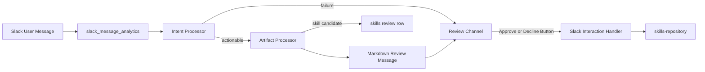

# Skill Review Slack Workflow

## Overview

Rework the Slack review workflow so new skill candidates and failure logs are
sent to a dedicated review channel through `SLACK_SKILL_REVIEW_CHANNEL_ID`, and
review messages include full markdown context plus approve/decline buttons.

## To-Dos

- Completed: Add `SLACK_SKILL_REVIEW_CHANNEL_ID` config helper and docs.
- Completed: Post full markdown skill review messages to the configured channel.
- Completed: Route analysis and generation failure logs to the configured
  channel.
- Completed: Add Block Kit buttons and Slack interaction handling for
  approve/decline.
- Completed: Run typecheck and document manual Slack app setup/testing steps.

## Context

The current logic creates a skill review candidate in
[`agent/lib/analytics/slack-artifact-generation-processor.ts`](../../agent/lib/analytics/slack-artifact-generation-processor.ts),
then sends a short message to the original Slack thread. Analysis failures are
currently handled in
[`agent/lib/analytics/slack-message-analysis-processor.ts`](../../agent/lib/analytics/slack-message-analysis-processor.ts)
and also post back to the original thread. The Slack helper
[`agent/lib/slack/api.ts`](../../agent/lib/slack/api.ts) supports only a simple
`chat.postMessage` call with `markdown_text`; there is no ready-made interactive
action handler visible in the repository or installed eve docs.

## Plan

1. Add review-channel configuration.

- Introduce a small config helper, likely
  [`agent/lib/slack/review-channel.ts`](../../agent/lib/slack/review-channel.ts),
  that reads `SLACK_SKILL_REVIEW_CHANNEL_ID` and throws/logs clearly when
  missing.
- Document the new env var in [`README.md`](../../README.md) and
  [`AGENTS.md`](../../AGENTS.md).
- Keep the original Slack thread notifications only if useful as a short
  acknowledgement; the main admin context goes to the configured review channel.

2. Send new skill review candidates to the review channel.

- Update
  [`agent/lib/analytics/slack-artifact-generation-processor.ts`](../../agent/lib/analytics/slack-artifact-generation-processor.ts)
  so `target === "skill"` posts to `SLACK_SKILL_REVIEW_CHANNEL_ID` instead of
  the source thread.
- Build a full markdown review message containing: skill id, slug, version,
  title, description, source Slack channel/thread/message/user, intent, model
  confidence/reason when available, and the full generated skill markdown
  content.
- Store notification metadata on the analytics row, including review channel id,
  posted message ts, and whether buttons were included.

3. Send analysis/generation failures to the same review channel.

- Change
  [`agent/lib/analytics/slack-message-analysis-processor.ts`](../../agent/lib/analytics/slack-message-analysis-processor.ts)
  so analysis failures post an admin-facing log to
  `SLACK_SKILL_REVIEW_CHANNEL_ID` with message id, Slack source, user message,
  and bounded error text.
- Also add the same review-channel failure notification path for artifact
  generation failures in
  [`agent/lib/analytics/slack-artifact-generation-processor.ts`](../../agent/lib/analytics/slack-artifact-generation-processor.ts),
  since failures can happen in either analysis or generation.
- Keep all Slack notification failures best-effort so analytics processing does
  not crash because the review channel post failed.

4. Add Slack buttons and action handling.

- Extend [`agent/lib/slack/api.ts`](../../agent/lib/slack/api.ts) with a Block
  Kit capable post helper that can send `blocks` plus markdown fallback.
- Add approve/decline buttons with stable action ids, for example
  `skill_review_approve` and `skill_review_decline`, and include the skill
  candidate id in the button value.
- Add a minimal Slack interaction handler using the supported eve/Nitro route
  mechanism discovered during implementation. If eve exposes no first-class
  route convention, add the smallest compatible HTTP handler supported by the
  project runtime.
- Verify the acting Slack user against `SKILL_ADMIN_USER_IDS` before mutating
  anything.
- Approve calls existing `approveSkillReviewCandidate()` in
  [`agent/lib/storage/skills-repository.ts`](../../agent/lib/storage/skills-repository.ts).
- Decline calls existing `softDeleteSkill()` with a reason such as
  `declined_from_slack_review`.
- After an action, update or reply to the review message with the result and
  admin user id so reviewers can see the final state.

5. Verification.

- Run `npm run typecheck`.
- If route support is added, verify build output and the expected Slack
  interactivity endpoint path.
- Manually test with a generated review candidate: message appears in the review
  channel, markdown contains full content, approve activates the skill, decline
  marks it deleted, and unauthorized users are rejected.

## Notes

- Slack Interactive Components must be configured in the Slack app to point to
  the new endpoint; code alone cannot enable button callbacks.
- This should not require a DB migration because approval/decline can reuse
  existing `skills.review_status` and lifecycle metadata.
