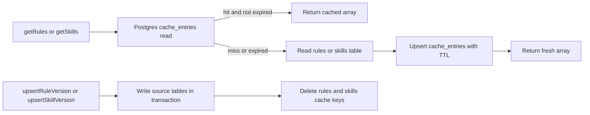

# Rewrite Redis Cache To Postgres Cache

## Scope

Replace the cache-aside layer for runtime `rules` and `skills` from Upstash Redis to a Postgres-backed cache table. Keep the existing public repository API unchanged:

- `getRules()`
- `getSkills()`
- `getRulesAndSkills()`
- `upsertRuleVersion()`
- `upsertSkillVersion()`
- `invalidateRulesSkillsCache()`

Neon Postgres remains the source of truth. The new cache table only stores short-lived serialized read results.

## Design

Add a Drizzle `cache_entries` table in `agent/storage/schema.ts`:

- `key` as the text primary key.
- `value` as `jsonb`.
- `expires_at` as a timezone-aware timestamp.
- Standard `created_at` and `updated_at` timestamps.
- An index on `expires_at` for optional cleanup.

Create `agent/storage/cache.ts` to expose a small Postgres cache API:

- `getCacheValue<T>(key)` returns `null` when the key is missing or expired.
- `setCacheValue(key, value, ttlSeconds)` upserts the value and expiry.
- `deleteCacheValues(keys)` deletes one or more cache keys.

Update `agent/storage/rules-skills-repository.ts` to use this cache API while preserving the existing cache keys and five-minute TTL:

- `eve:rules:v1`
- `eve:skills:v1`

Reads should still cache empty arrays (`[]`) so repeated empty reads do not hit the source tables. Writes should still invalidate both rules and skills cache keys after the source-table transaction succeeds.

## Migration And Cleanup

Generate a Drizzle migration for `cache_entries` with `npm run db:generate`. Apply it with `npm run db:migrate` when `.env.local` contains a valid `DATABASE_URL`.

Remove Redis-specific implementation details:

- Delete `agent/storage/redis.ts`.
- Remove `@upstash/redis` from `package.json` and `package-lock.json`.
- Remove `UPSTASH_REDIS_REST_URL` and `UPSTASH_REDIS_REST_TOKEN` from `.env.example`.
- Update docs that describe runtime storage as using Upstash Redis.

## Verification

Run:

- `npm run typecheck`
- `npm run db:generate`
- `npm run db:migrate` when local database access is available

Manual smoke checks when database access is available:

- First `getRules()` / `getSkills()` reads source tables and writes `cache_entries` rows, including `[]`.
- Second read returns from `cache_entries`.
- `upsertRuleVersion()` or `upsertSkillVersion()` deletes the two cache keys.
- Next read repopulates fresh cache rows.

## Risks

This removes one external service, but cache operations now use the same Neon database as the source tables. That tradeoff is acceptable for this Slack agent's low-volume rules and skills cache. If read traffic grows significantly, a dedicated low-latency cache may become useful again.
