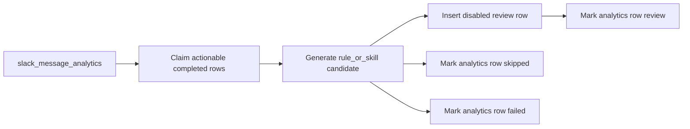

# Slack Artifact Review Schedule

## Goal

Add an Eve schedule that turns completed Slack analytics signals into inactive review candidates in the existing DB-backed `rules` and `skills` tables, preserving the originating Slack user and message metadata.

## Scope

Implement a second-stage scheduled processor that reads completed `slack_message_analytics` rows classified as `skill.create`, `skill.improve`, `rule.create`, or `rule.improve`, generates a candidate artifact, and inserts it into the existing `skills` or `rules` table with review metadata. The candidates should not be loaded by the agent yet because they will be stored as inactive and disabled review rows.

Existing context:

- `agent/schedules/slack-message-analytics.ts` already processes raw Slack messages every minute.
- `agent/lib/analytics/slack-message-intent.ts` already classifies rows into artifact-focused intents.
- `agent/lib/storage/rules-skills-repository.ts` already has active version upserts, but those immediately enable artifacts, so review candidates need separate insert helpers.
- `agent/skills/repository-skills.ts` only loads enabled skills, so disabled review rows are safe.

## Implementation Order

1. Save this approved plan in English under `proto/features/6-2026-06-30-slack-artifact-review-schedule.md`.
2. Implement the schema and migration changes.
3. Extend the storage repositories.
4. Add the artifact generation prompt, generator, and processor.
5. Add the Eve schedule.
6. Run verification.

## Data Model

Update `agent/lib/storage/schema.ts` and generate a Drizzle migration:

- Add artifact generation tracking to `slack_message_analytics`:
  - `artifact_generation_status`: `pending | processing | review | skipped | failed`
  - `artifact_generation_error`
  - `artifact_generated_at`
- Add a review status marker to `rules` and `skills`:
  - `review_status`: `approved | review`
  - Existing active rows should default to `approved`.
  - Generated candidates should use `review`, `enabled=false`, and `active=false`.

Store Slack provenance in `rules.metadata` and `skills.metadata`:

- `source: "slack_message_analytics"`
- `slack.teamId`, `channelId`, `threadTs`, `messageTs`, `userId`
- `analyticsId`
- Original `intent`, `confidence`, `evidence`, and generation model or prompt metadata.

## Storage API

Extend `agent/lib/storage/rules-skills-repository.ts` with review-only insert helpers instead of reusing active upserts:

- `createRuleReviewCandidate(input)` inserts a disabled and inactive `rules` row.
- `createSkillReviewCandidate(input)` inserts a disabled and inactive `skills` row.
- Candidate version should be based on the current max version for the slug so repeated review drafts do not collide with the `(slug, version)` unique index.
- Do not change `getRules()`, `getSkills()`, or active upsert behavior.

Extend `agent/lib/storage/slack-message-analytics-repository.ts`:

- Claim completed actionable rows whose artifact generation has not yet run.
- Mark rows as `review`, `skipped`, or `failed` after generation.
- Use row locking and `skip locked` like the existing analysis processor to avoid duplicate schedule work.

## Generation Pipeline

Add a focused generator under `agent/lib/analytics/`:

- `slack-artifact-generation.ts`: structured model call that converts one analytics row plus current artifact inventory into a candidate rule or skill.
- `slack-artifact-generation-processor.ts`: claims eligible analytics rows, calls the generator, writes review candidates, and updates the analytics generation status.

Add a prompt constant under `agent/lib/prompts/`:

- `slack-artifact-generation-prompt.ts`

The prompt should generate:

- For skills: `slug`, `title`, `description`, and markdown `content` suitable for `defineSkill({ markdown })`.
- For rules: `slug`, `title`, `scope`, and rule `content` in English.
- Conservative output: if the Slack message is too vague, return a structured `skip` result rather than inventing behavior.

## Schedule

Add a new Eve schedule in `agent/schedules/slack-artifact-review.ts`.

Use `defineSchedule({ cron, run })` and process a small batch on each run. A conservative cadence such as every 5 minutes is enough because this is review material, not the immediate Slack response path.

## Verification

Run after implementation:

- `npm run typecheck`
- `npm run build`
- `npm run db:generate` and review the migration
- If `.env.local` has `DATABASE_URL`, run `npm run db:migrate`
- Dev smoke test by triggering the schedule route after seeding or creating a completed analytics row with an actionable intent
